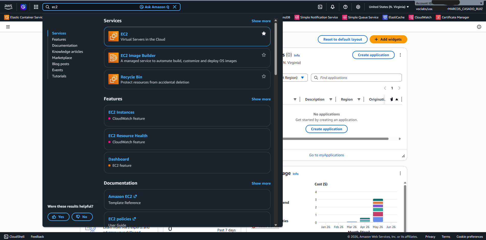
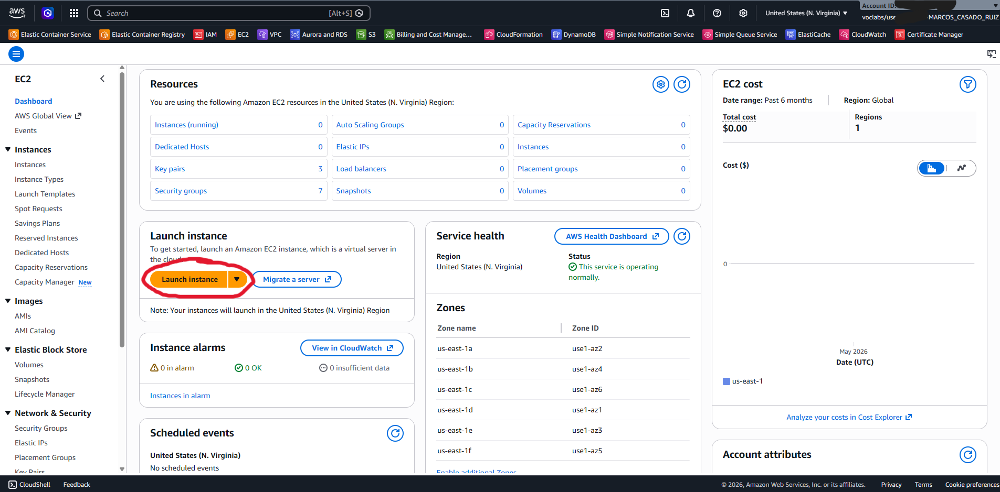
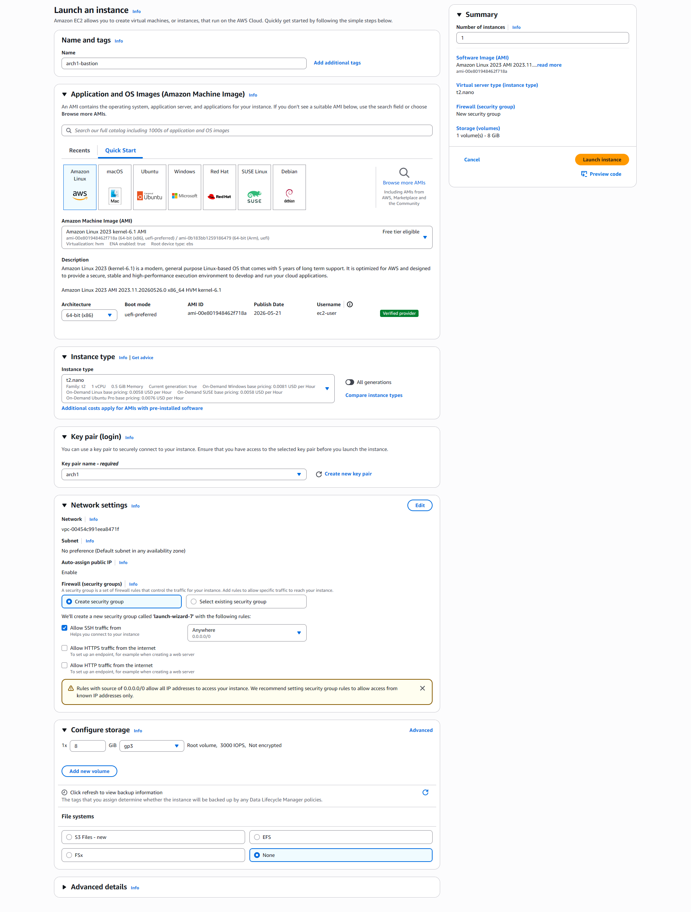
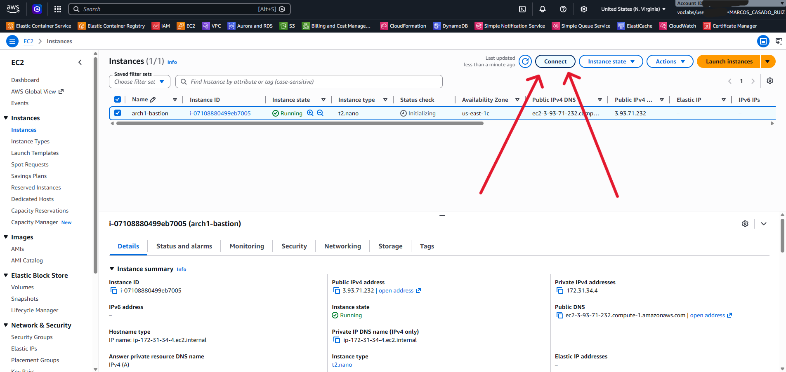
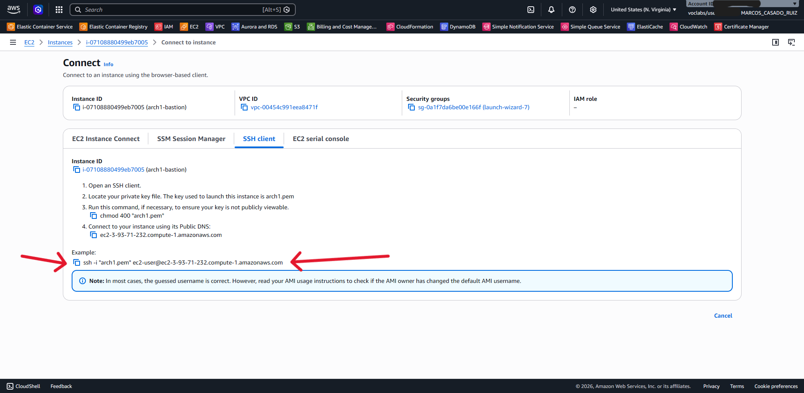
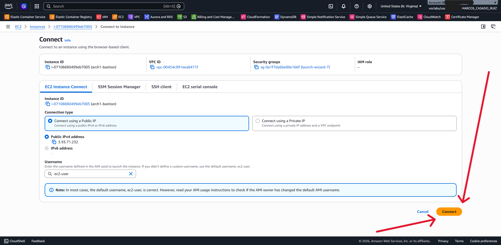

# Configuración de la máquina virtual EC2 como bastión

#### **Paso 1**: Acceder al servicio de máquina virtuales EC2 en la consola web de gestión de AWS.   
Esto puede hacerse buscando 'EC2' en la barra de búsqueda de servicios, o accediendo a través del menú de servicios.

#### **Paso 2**: Lanzar una instancia EC2 utilizando el botón naranja que aparece señalado con un círculo rojo en la siguiente imagen:

#### **Paso 3**: Configurar los siguientes campos de la EC2 tal y como se muestra también en la imagen.
- Nombre (Name): arch1-bastion (_o el que se le quiera dar_)
- Tipo de instancia (Instance Type): t2.nano (_puede darle cualquier otro tamaño, aunque con el mínimo es suficiente para el despliegue_)
- Llave de acceso (Key Pair): crear preferiblemente una nueva llave de acceso, en este caso se ha creado y usado arch1.pem, aunque puede usarse cualquier otra. Es importante descargar la llave de acceso y guardarla preferiblemente en el directorio del despliegue, ya que es necesaria para conectarse a la máquina virtual EC2 por SSH.

#### **Paso 4**: Conectarse a la instancia EC2 utilizando, en este caso, la conexión integrada por AWS. Puede utlizarse también cualquier cliente SSH, aunque la conexión integrada es la más sencilla para usuarios sin experiencia previa con máquinas virtuales.

Puede observarse ahora el panel de conexión por SSH donde se señala el comando relevante para realizar la conexión:

También se muestra ahora el panel de conexión integrada que se recomendaba usar para este caso donde se señala el botón de conexión (Connect) que abrirá un shell en otra ventana del navegador conectada a la máquina virtual EC2:

Llegados a este punto, ya se tiene acceso a la máquina virtual EC2 que actuará como bastión de despliegue, y se pueden seguir los pasos indicados en el README para completar el despliegue de la arquitectura.
