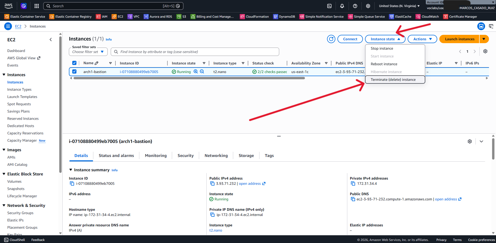

# Borrado de la máquina virtual EC2 de bastión

En caso de haber utilizado la máquina virtual EC2 de bastión para el despliegue, es importante eliminarla una vez se hayan eliminado los recursos de gamestore para evitar costes innecesarios. Para ello, basta con acceder a la consola de AWS, navegar a la sección de EC2, seleccionar la instancia correspondiente, seleccionar el botón de estado de la instancia (Instance State) y elegir la opción de eliminación. En el cuadro flotante que aparecerá, basta con confirmar la eliminación para que la máquina virtual EC2 de bastión sea eliminada.

